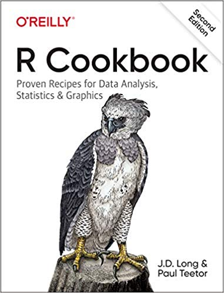
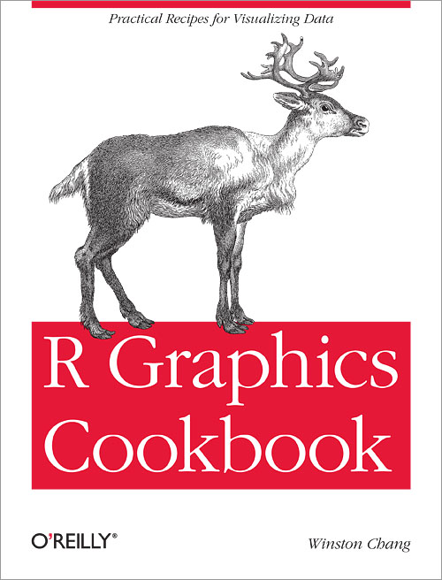

# Introduction to Visualization

## Books {.unnumbered}

::: {layout-ncol=3}

:::

## Resources {.unnumbered}

[**Rdocumentation**](https://www.rdocumentation.org/): overview pages for R packages

[**The R Graph Gallery**](https://r-graph-gallery.com/): a collection of charts made with the R programming language

[**R Charts**](https://r-charts.com/): code examples of R graphs

## Packages {.unnumbered}

**tidyr:** Creating tidy data\
[Overview](https://tidyr.tidyverse.org/) \| [Cheetsheet](https://github.com/rstudio/cheatsheets/blob/main/tidyr.pdf)

**dplyr:** Grammar of data manipulation\
[Overview](https://dplyr.tidyverse.org/) \| [Cheetsheet](https://github.com/rstudio/cheatsheets/blob/main/data-transformation.pdf)

**ggplot2:** Declaratively creating graphics\
[Overview](https://ggplot2.tidyverse.org/) \| [Cheatsheet](https://github.com/rstudio/cheatsheets/blob/main/data-visualization.pdf)
